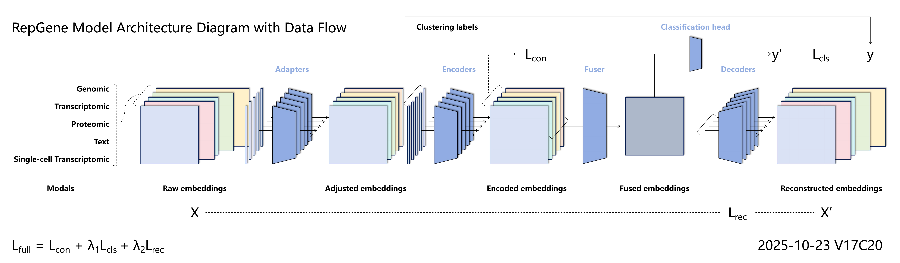

<div align=center></div>

# RepGene

#### You Only Need One Gene Representation

- Author: Haiyang HOU
- Date: 2025-11-11
- Version: v0.17.0

## Model Architecture Diagram with Data Flow

<div align=center></div>

## Description

This project is based on Python 3.11 and developed using PyCharm on Windows 11.

1 computer for development and testing:

- Desktop: Windows 11, NVIDIA GeForce RTX 4070 Super 12GB, PyCharm 2024, Python 3.11, PyTorch 2.1.0, CUDA 12.1, [2025]

## Installation
Requirements: python=3.11, pytorch=2.1.0, NVIDIA GPU

Refer to requirements.txt

## Get full data-sets & models
Please get the complete models and test dataset from the following link.

```text
https://pan.xunlei.com/s/VOdljNrt_gITGdvjbMBi3PLkA1?pwd=i9yx#
```

## Use examples


